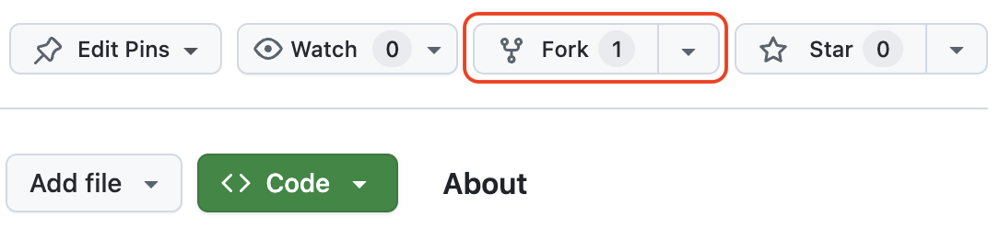
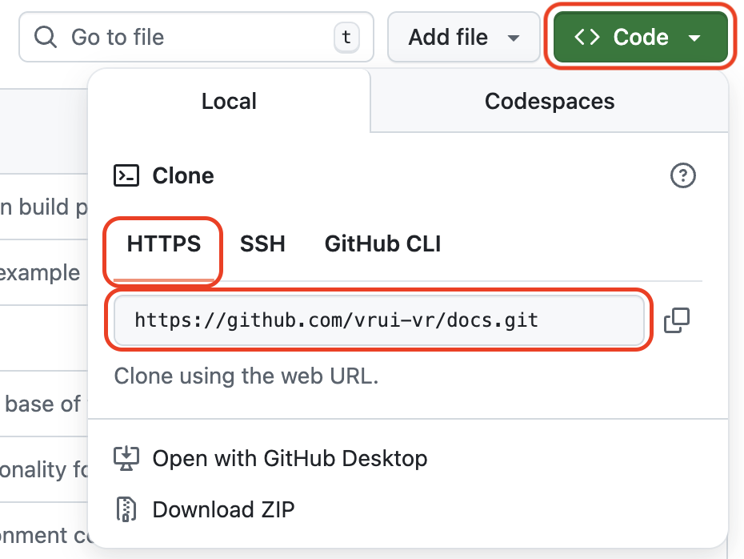
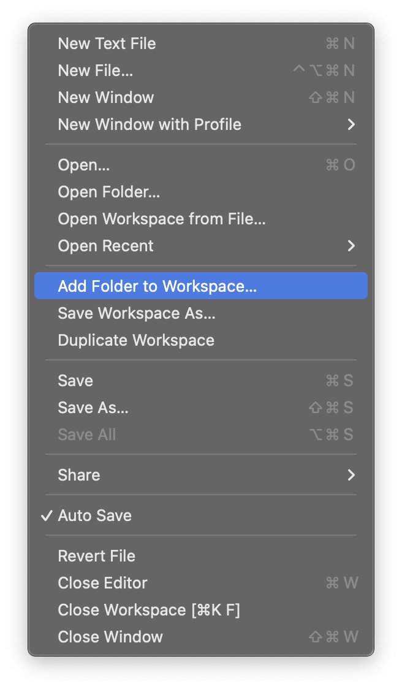

<!-- Badges -->
[](https://github.com/vrui-vr/vrui-vr.github.io/actions/workflows/build-and-deploy.yml)
[](https://vrui-vr.github.io/vrui-vr.github.io/)
[](https://www.gnu.org/licenses/old-licenses/gpl-2.0.en.html)

# vrui-vr.github.io

A central repository that hosts the configuration/build settings and base site structure for documentation across all the repos in the Vrui organization.

The docs are built using [Zensical](https://www.zensical.org/), which is the sucessor to [Material for MkDocs](https://squidfunk.github.io/mkdocs-material/).

## Table of Contents

- [vrui-vr.github.io](#vrui-vrgithubio)
  - [Table of Contents](#table-of-contents)
  - [How it works](#how-it-works)
    - [Updating the docs site](#updating-the-docs-site)
    - [Site config](#site-config)
    - [Merging `nav.toml` files](#merging-navtoml-files)
    - [Behind the scenes](#behind-the-scenes)
  - [Set up (VSCode)](#set-up-vscode)
    - [Forking and Cloning](#forking-and-cloning)
      - [Forking](#forking)
      - [Cloning](#cloning)
    - [Setting up and Fetching the Upstream](#setting-up-and-fetching-the-upstream)
    - [Optional: Setting up a VSCode workspace](#optional-setting-up-a-vscode-workspace)
  - [Workflow](#workflow)
    - [Go to main branch](#go-to-main-branch)
    - [Fetch and merge](#fetch-and-merge)
    - [Adding documentation for a new repo](#adding-documentation-for-a-new-repo)
    - [Testing changes locally](#testing-changes-locally)

## How it works

Documentation for each repo is hosted in the `docs/` directory of that repo. This repository aggregates and builds the documentation from all repos in the Vrui organization.

### Updating the docs site

When the `docs/` directory is updated in any repo (e.g. `vrui-vr/arsandbox`), the `docs-update.yml` GitHub Action is triggered, which tells the `vrui-vr.github.io` repo (this one) to pull in the latest changes and rebuild the documentation site.

The most up-to-date version of `docs-update.yml` is located in this repository under `templates/workflows/docs-update.yml`.

### Site config

The main configuration for the documentation site is in `zensical.base.toml`. This file specifies the site name, navigation menu, theme, plugins, and other settings.

This is important because it ensures a consistent look/feel across all documentation and access to plugins, regardless of which repo the docs come from.

### Merging `nav.toml` files

While the base navigation structure is defined in `zensical.base.toml`, each repo can define its own navigation structure by adding a `nav.toml` file in its `docs/` directory.

The `nav.toml` files from each repo are merged into (`zensical.generated.toml`) which is used to build the documentation site. The merging is done in the order that the repos are listed in `repos.txt`.

The base navigation structure is defined in `zensical.base.toml`, which includes the home page and other common pages. The `zensical.generated.toml` file then includes this base navigation and the generated & merged navigation.

1. First, the `build-and-deploy-docs.yml` GitHub Action in this repository pulls in the latest changes under `<repo>/docs/`from all repos listed in `repos.txt`.
2. Then, it runs the `scripts/generate_zensical.py` script to merge the `nav.toml` files from each repo into a single `zensical.generated.toml` file.

### Behind the scenes

In order to make all the repos play nice with each other, the `docs-update.yml` workflow in each repo references a common `DOCS_DEPLOY_TOKEN` secret, which is a GitHub personal access token with `repo` and `workflow` scopes.

This token is an organization-level secret, so it can be used by any repo in the Vrui organization. That way, no individual repo needs to have its own token, which would be a pain to manage.

Most of the existing repositories in the Vrui organization already have access to this secret. However, if you are creating a new repo and want to add documentation for it, you will need to give that repo access to the `DOCS_DEPLOY_TOKEN` secret by going to Vrui's Settings > Secrets and variables > Actions > Organization secrets, and then clicking "Edit DOCS_DEPLOY_TOKEN" (the pencil icon). Once there, click the gear icon and add the new repository to the list of selected repositories that can access the secret.

> [!IMPORTANT]
> The `DOCS_DEPLOY_TOKEN` secret value is based on a personal access token (PAT) that is owned by a specific user (currently me: @nredick). It is set to never expire, but if that user leaves the organization, the token will need to be regenerated and updated in the organization secrets to someone else with permissions to make changes to the repos. In short, the PAT behind the `DOCS_DEPLOY_TOKEN` secret allows the repos to act on the user's behalf to tell `vrui-vr/docs` that it's time to rebuild (which requires a certain level of permissions).

What this looks like:


A new build and deploy job is triggered, and appears to be "manually" run by the user who owns the PAT (currently me: @nredick).

## Set up (VSCode)

Below, we'll include some tips of how to setup a VSCode workspace, clone and fork multiple repositories, and default/upstream repositories, if you choose to contribute to Vrui documentation and/or code.

### Forking and Cloning

> [!TIP]
> These instructions are adapted from GitHub's site, which contains more comprehensive instructions: [Fork a repository](https://docs.github.com/en/pull-requests/collaborating-with-pull-requests/working-with-forks/fork-a-repo)

#### Forking
To make a copy of an application repository (and the `vrui-vr/vrui-vr.github.io` repository), you will create a fork, a new repository that is a copy of the original “upstream” repository (created by Vrui maintainers). Forks can be used to create changes outside of the upstream repository, which are then proposed back to the upstream repository in the form of a pull request.

To fork a repo, navigate to your preferred repo, click the fork button, and create a new fork with your GitHub account as the owner, checking the "Copy the `main` branch only" box:



This fork can now be found in your GitHub account's list of repositories.

#### Cloning

After forking, you will have a fork of a Vrui repo in you GitHub account. Next, you will need to clone that fork to save the files in that repository locally on your computer.

0. Before cloning a repository, it's recommended to create a folder in your file system, a parent directory, to store your cloned Vrui repositories. This can be done in your terminal via the following command:

```sh
mkdir <parent-directory>
```


1. Navigate your fork in GitHub and copy the HTTPS URL:



2. In a new VSCode window, open the terminal and navigate to your parent directory.

```sh
cd <vrui-title>
```

3. Then, type the following command in your terminal, pasting your fork's HTTPS URL instead of the link below.

```sh
git clone https://github.com/<YOUR-USERNAME>/<repository-name>
```

> [!TIP]
> Check out the "Cloning your forked repository" section in the GitHub page referenced earlier: [Fork a repository](https://docs.github.com/en/pull-requests/collaborating-with-pull-requests/working-with-forks/fork-a-repo)


### Setting up and Fetching the Upstream

After forking and cloning one of Vrui's repositories, you may need to add an "upstream" repository explicitly. An upstream repository is the original project repository that you forked or cloned from. In this case, you want to set the upstream as the original Vrui repo that you forked, as found on [Vrui's GitHub](https://github.com/vrui-vr). The upstream repository is where Vrui maintainers will add updates to code and documentation. By adding the upstream, you will then be able to safely incorporate Vrui maintainer's latest changes to the repositories into your local fork.

> [!TIP]
> Angle brackets `<>` in commands below are placeholders, meaning that you have to replace everything between, and including, the angle brackets with some text that depends on your specific circumstances.

However, some settings automatically add the upstream after cloning. Paste the following command your terminal to check:

```sh
git remote -v
```
If the `vrui-vr/<repo-name>` repository is listed as the upstream, then you do not need to add it and can skip the following steps.

Otherwise, copy the following commands in your VSCode terminal to add the original repository as the upstream:

1. Navigate to the upstream (`vrui-vr/<repo-name>`) repository in GitHub and copy the HTTPS URL. Next, type the following command in your terminal, pasting the HTTPS URL in place of the link below:


```sh
git remote add upstream https://github.com/<ORIGINAL-OWNER/ORIGINAL-REPOSITORY.git>
```

2. This command downloads the latest changes made in the upstream repository into your local Git repository without automatically merging them into the current branch (which may be main, if you haven't created another branch) of your fork.

```sh
git fetch upstream
```

3. This command integrates the latest changes from the "upstream" repository, downloaded in the last command, into your own fork.

```sh
git rebase upstream/main
```

> [!TIP]
> Check out the "Configuring Git to sync your fork with the upstream repository" section in the GitHub page referenced earlier: [Fork a repository](https://docs.github.com/en/pull-requests/collaborating-with-pull-requests/working-with-forks/fork-a-repo)

> [!TIP]
> Check out GitHub's page on repositories to understand the different kinds and terminology: [About repositories](https://docs.github.com/en/repositories/creating-and-managing-repositories/about-repositories).


### Optional: Setting up a VSCode workspace

To contribute to Vrui, either in documentation and/or in code, one easy way to work in multiple cloned Vrui repositories in parallel is in a VSCode workspace. A VSCode workspace is a collection of one or more folders that are opened in a VSCode window (instance). Vrui is organized in multiple repositories (found [here](https://github.com/vrui-vr)), including a repository for each supported application, a repository to setup documentation (`vrui-vr/vrui-vr.github.io`), and the toolkit itself (`vrui-vr/vrui`).

>[!NOTE]
> Cloning and Forking repositories are expanded upon in an [earlier section](#forking-and-cloning), and is also covered in Vrui's [Contributing doc](https://vrui-vr.github.io/CODE_OF_CONDUCT/).

Before creating a workspace, it's recommended to create a parent directory (folder) in your file system that you will store cloned Vrui repositories in. This will make adding the cloned repositories to a workspace much simpler, as you will only need to navigate to one location in your file system. Creating a parent directory can be done in a VSCode terminal via the command:

```sh
mkdir <parent-directory>
```

To move into the parent directory:

```sh
cd <parent-directory>
```

To add the cloned repositories in your parent directory to a workspace, open an empty VSCode window (if you have other folders opened in your current window). On a Mac, navigate to the File menu select "Add Folder to Workspace...". It's recommended to navigate to your parent directory and add each cloned repo folder to your workspace, not the parent directory itself.



To be able to reopen this workspace later on, click "Save Workspace as...", and the workspace will now be stored in your parent directory.


> [!TIP]
> If you would like to download VSCode, check out this link: [Download Visual Studio Code](https://code.visualstudio.com/download). For a more comprehensive explanation of workspaces, check out this link: [What is a VS Code workspace?](https://code.visualstudio.com/docs/editing/workspaces/workspaces)


## Workflow

This section outlines a typical workflow for keeping your fork up to date, contributing documentation, and testing changes in [Vrui's website](https://vrui-vr.github.io/).

### Go to main branch

Before pulling in updates or starting new work, make sure you are on your repository’s main branch. This ensures you are syncing changes into the correct base branch.

In your terminal, navigate to your local repository and paste the following command:

```sh
git checkout main
```

### Fetch and merge

Once you are on the main branch, fetch the latest changes from the upstream repository:

```sh
git fetch upstream
```

Next, merge those updates into your local main branch:

```sh
git rebase upstream/main
```

If no conflicts occur, your repository is now up-to-date. If there are conflicts, resolve them before continuing. Otherwise, push the updated changes to main:

```sh
git push origin main
```

> [!NOTE]
> To contribute changes to Vrui repos, don't push changes to your main branch and instead follow the steps in the [Contributing doc](https://vrui-vr.github.io/CODE_OF_CONDUCT/) to create branches for individual issues.


### Adding documentation for a new repo

1. Ensure the new repo has a `docs/` directory with a `index.md` file.
2. Copy `templates/workflows/docs-update.yml` to `.github/workflows/docs-update.yml` in the repo that you are creating docs in. See [`vrui-vr/arsandbox/docs/nav.toml`](https://github.com/vrui-vr/arsandbox/blob/main/docs/nav.toml) for an example of how to structure the `nav.toml` file. Recommended: check out `zensical.generated.toml` in *this* repository to see how the `nav.toml` files are merged.
3. Create the `nav.toml` file in the `docs/` directory of the new repo, following the format of existing `nav.toml` files. (Do not rename it to something else, as the script expects it to be named `nav.toml`.)
4. Add the new repo to the `repos` list in `repos.text` in *this* repository.
5. Create a change in the main branch of the repo that you are adding docs for, which will trigger the `docs-update.yml` workflow and update the docs site.
6. Check out the changes at https://vrui-vr.github.io/ after the build-and-deploy job has completed (a few minutes).


### Testing changes locally

You can (AND SHOULD) test any changes to the documentation site locally by following these steps:

1. Clone this repository (vrui-vr.github.io) (and the repository you are creating docs for) to your local machine.
2. Ensure that they are located in the same parent directory, e.g.:

   ```sh
   ~/<parent>/docs
   ~/<parent>/arsandbox
   ```

3. Make sure you have the correct dependencies installed. If you use conda (or mamba), you can create and activate the environment with:

   ```sh
   conda env create -f environment.yml
   conda activate vrui
   ```

4. Run `./scripts/local_build_and_serve.sh` from the root of *this* repository. This will create symbolic links to the `docs/` directories of all repos listed in `repos.txt` if you have a local version of that repo, then it will generate the merged `zensical.generated.toml` file, and then start a local Zensical server. When finished, it will clean up the symbolic links.

Example output:
```
❯ ./scripts/local_build_and_serve.sh
Cleaning up generated links and files...
🔗 Hard-linking vrui docs...
✅ Created hard-link tree → ~/repos/datalab/vrui-vr.github.io/docs/vrui
🔗 Hard-linking .github files to root docs...
✅ Linked code_of_conduct.md
✅ Linked contributing.md
✅ Linked governance.md
✅ Linked readme.md
✅ Hard-linked assets
Generating zensical.generated.toml ...
Merging: docs/vrui/nav.toml
Starting local Zensical server...
Serving ~/repos/datalab/vrui-vr.github.io/site on http://localhost:8000
Build started
+ /arsandbox/installation/software/simple_install/
+ /arsandbox/installation/software/
+ /arsandbox/installation/hardware/note_on_water_simulation/
+ /arsandbox/installation/hardware/step4/
+ /arsandbox/installation/hardware/step6/
+ /kinect/installation/
+ /kinect/installation/per_pixel_depth_correction/
+ /kinect/usage/recording_3d_movies/
+ /arsandbox/installation/
+ /governance/
+ /arsandbox/installation/software/manual_install/
+ /kinect/installation/projection_matrix_calc/
+ /kinect/installation/guide/
+ /code_of_conduct/
+ /kinect/usage/
+ /contributing/
+ /readme/
+ /
+ /vrui/installation/
+ /arsandbox/installation/hardware/step2/
+ /kinect/
+ /arsandbox/installation/hardware/step7/
+ /arsandbox/installation/software/advanced_install/
+ /arsandbox/
+ /arsandbox/installation/hardware/
+ /vrui/
+ /kinect/usage/merging_3d_facades/
+ /arsandbox/installation/hardware/step3/
+ /arsandbox/in_action/
+ /kinect/installation/intrinsically_calibrating_a_single_kinect/
+ /arsandbox/installation/hardware/step8/
+ /arsandbox/installation/hardware/step5/
+ /arsandbox/installation/hardware/step1/
^CReceived interrupt, exiting
✅ Done.
Cleaning up generated links and files...
```
